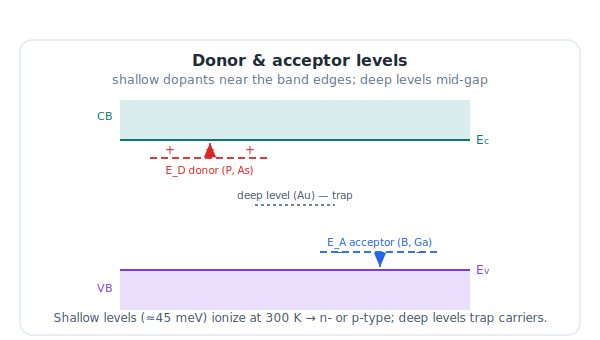
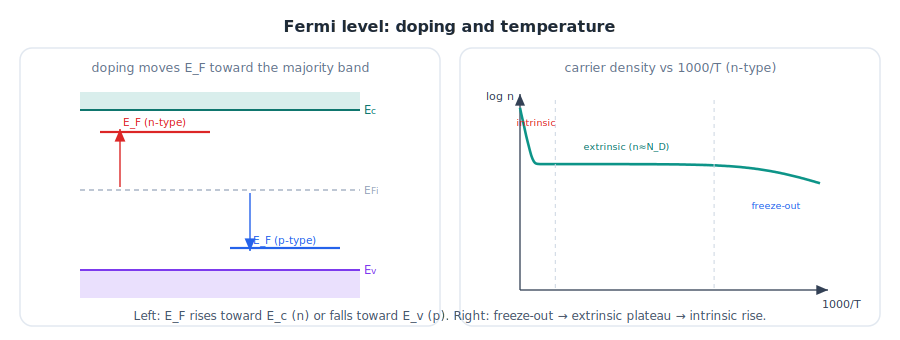
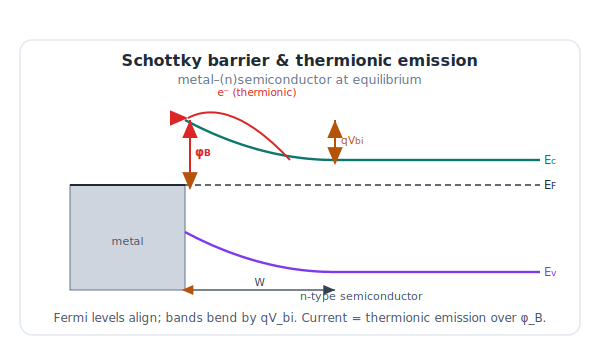
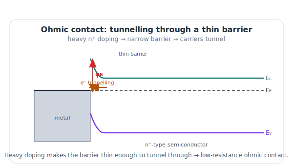
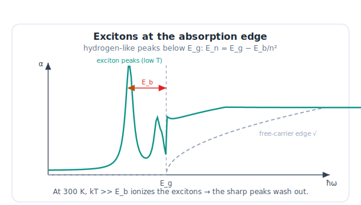
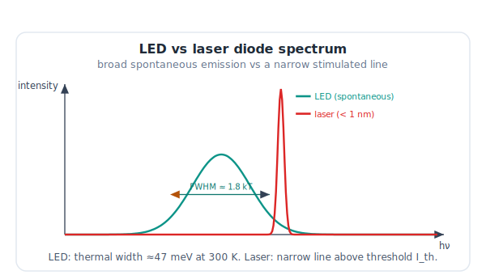

# LELEC2330 — Opto-electronic and Power Devices
## Lecture Notes — Extrinsic Properties of Semiconductors

*Companion notes to the lecture slides. Academic year 2026–2027 — Prof. Laurent A. Francis, UCLouvain (ICTEAM Institute & Louvain School of Engineering).*
*Primary texts: Neamen [default] and Grundmann [2]; metal–semiconductor sections follow ref. [4]; see the full **References** at the end.*

> **License.** © Laurent A. Francis, UCLouvain. Released under
> [CC BY-SA 4.0](https://creativecommons.org/licenses/by-sa/4.0/). Share and adapt with
> attribution, under the same license. Textbook figures and third-party images from the
> original slides are **not** included and remain under their own copyright.

---

### How to read these notes

The *Intrinsic* lectures (I–III) described the pure crystal: bands, carriers, transport, optics.
This lecture makes the semiconductor **useful** by adding **impurities (doping)** and **junctions**.
Ten movements: **(1)** donor/acceptor impurities; **(2)** ionization energies; **(3)** the Fermi
level and carrier concentrations in doped material; **(4)** generation & recombination; **(5)**
ambipolar transport; **(6)** the Fermi energy of metals; **(7)** the Schottky (metal–semiconductor)
diode; **(8)** ohmic contacts; **(9)** band-to-band absorption (with excitons & quantum efficiency);
**(10)** band-to-band recombination (LED, laser diode, photoluminescence).

> **Guiding thread.** The same two devices, now built from doped junctions.
> **Solar cell:** an n⁺ emitter (P donors) on a p-type base (B acceptors) — photo-generated minority
> carriers diffuse to the junction and are collected. **LED:** a p–n junction in a direct-gap III–V —
> injected carriers recombine radiatively. Doping fixes $E_F$ on each side and builds the junction.

---

## 1. Donor and acceptor impurities

Replacing a host atom with one from a neighbouring column adds or removes one valence electron.

- A **donor** (group V in Si: **P, As, Sb**) has one extra electron, weakly bound. It sits on a
  **discrete donor level $E_D$** just below $E_c$; ionizing it ($D\to D^++e^-$) puts an electron in the
  conduction band → **n-type**. Each donor holds **at most one electron** (one spin).
- An **acceptor** (group III in Si: **B, Ga, Al**) is missing one electron. It sits on a level $E_A$
  just above $E_v$; ionizing it ($A\to A^-+h^+$) puts a hole in the valence band → **p-type**.

> **Guiding thread.** The solar cell needs *both* types in one device: an n⁺ emitter on a p base.

---

*Donor levels sit just below E_c, acceptor levels just above E_v; deep levels near mid-gap act as traps. Original figure.*

## 2. Ionization energies

How tightly is the extra carrier bound? Treat the ionized core + electron as a **hydrogen-like atom**
embedded in the crystal — the **hydrogenic (Bohr) model** — but with two crystal corrections:
the permittivity $\varepsilon_r$ screens the Coulomb attraction, and the carrier has an **effective mass**
$m^*$.

$$r_n=\frac{\varepsilon_r}{m^*/m_0}\,n^2 a_0,\qquad
E_{\text{ion}}=13.6\ \text{eV}\times\frac{m^*/m_0}{\varepsilon_r^{2}}.$$

For **Si** ($\varepsilon_r=11.7$, $m^*\approx0.26\,m_0$): the orbit is $r_1\approx 45\,a_0$ (it spans many
lattice sites — self-consistent with the effective-mass picture), and

$$E_{\text{ion}}\approx 25.8\ \text{meV}\ \ll\ E_g=1.12\ \text{eV}.$$

(Compare the free hydrogen atom: 13.6 eV.) Because $E_{\text{ion}}\sim k_BT$ at 300 K, these are
**shallow** levels — **nearly fully ionized at room temperature**.

- **Shallow levels** (P, As, B, Ga in Si): close to a band edge; the dopants of choice.
- **Deep levels** (Au, Cu, Fe in Si): near mid-gap; effective **recombination/trap centres** (relevant
  for §4–§5 and for lifetime killers).
- **Amphoteric impurities** in III–V: a group-IV atom (e.g. Si in GaAs) can act as **donor or acceptor**
  depending on which sublattice it occupies.

> **Guiding thread.** Full ionization at 300 K means the **design carrier density ≈ the doping density**.

---

## 3. Fermi level and carrier concentrations in doped semiconductors

### 3.1 Equilibrium concentrations (recap)

$$n_0=N_c\,e^{-(E_c-E_F)/k_BT},\qquad p_0=N_v\,e^{-(E_F-E_v)/k_BT},\qquad n_0p_0=n_i^2.$$

Useful intrinsic-referenced forms:

$$n_0=n_i\,e^{(E_F-E_{Fi})/k_BT},\qquad p_0=n_i\,e^{(E_{Fi}-E_F)/k_BT}.$$

### 3.2 Where the intrinsic level sits

Setting $n_0=p_0$ gives the **intrinsic Fermi level**

$$E_{Fi}=\frac{E_c+E_v}{2}+\frac{k_BT}{2}\ln\frac{N_v}{N_c}
=\frac{E_c+E_v}{2}+\frac{3k_BT}{4}\ln\frac{m_p^*}{m_n^*}.$$

The shift from mid-gap is small (the DOS asymmetry through $m^*$) and is usually neglected.

### 3.3 Doped material

For shallow dopants, fully ionized at 300 K:

- **n-type:** $n_0\approx N_D$, and $E_F$ moves **up** toward $E_c$:
  $E_F-E_{Fi}=k_BT\ln(N_D/n_i)$.
- **p-type:** $p_0\approx N_A$, and $E_F$ moves **down** toward $E_v$:
  $E_{Fi}-E_F=k_BT\ln(N_A/n_i)$.

The fraction of **ionized** donors is set by occupation of the donor level,

$$N_D^+=\frac{N_D}{1+g\,e^{(E_F-E_D)/k_BT}}\quad(g=2),$$

and exact $E_F$ follows from **charge neutrality**

$$\boxed{\,n_0+N_A^-=p_0+N_D^+\,}$$

which in general needs a **numerical/graphical** solution (the graphical construction has slopes
$\pm1/k_BT$).

### 3.4 Temperature regimes

A doped semiconductor passes through three regimes as $T$ rises:

- **Freeze-out** (low $T$): carriers condense back onto dopant levels, $N_D^+<N_D$.
- **Extrinsic / saturation** (around 300 K): full ionization, $n_0\approx N_D=\text{const}$.
- **Intrinsic** (high $T$): $n_i$ overtakes the doping, $n_0\approx n_i(T)$ and the material forgets its
  doping.

### 3.5 Degeneracy and compensation

- **Degenerate** semiconductor: if $E_F$ lies within $\sim3k_BT$ of a band edge (or inside the band), the
  Boltzmann approximation fails — use **full Fermi–Dirac** statistics; the material behaves metal-like.
- **Compensation:** with both species present, only the **net** doping counts, $\lvert N_D-N_A\rvert$;
  a partially compensated sample has reduced free-carrier density.

> **Guiding thread.** Doping fixes $E_F$ on each side; the $E_F$ offset across a junction *is* the
> built-in potential that drives the solar cell and sets the LED turn-on.

---

*Left: doping pushes E_F toward the majority band. Right: carrier density vs 1000/T — freeze-out, extrinsic plateau, intrinsic rise. Original figure.*

## 4. Generation and recombination

### 4.1 Diffusion and the Einstein relation

A concentration gradient drives a **diffusion current** (coefficients $D_n,D_p$ in cm²/s):

$$J_n=qD_n\frac{dn}{dx},\qquad J_p=-qD_p\frac{dp}{dx}.$$

Drift and diffusion are linked by the **Einstein relation**:

$$\boxed{\;\frac{D}{\mu}=\frac{k_BT}{q}\approx 26\ \text{mV at }300\ \text{K}\;}$$

### 4.2 Excess carriers and minority-carrier lifetime

At equilibrium **generation = recombination**. An external excitation injects **excess** carriers
$\delta n=\delta p$. Under **low-level injection** in p-type material, the excess minority electrons
decay exponentially,

$$\delta n(t)=\delta n(0)\,e^{-t/\tau_{n0}},\qquad R=\frac{\delta n}{\tau_{n0}},$$

defining the **excess minority-carrier lifetime** $\tau$.

> **Guiding thread.** Photo-generation is the **useful** process in a solar cell; radiative recombination
> is the **useful** process in an LED. Lifetime decides how far carriers travel before they are lost.

---

## 5. Ambipolar transport

### 5.1 Continuity and the ambipolar equation

Combining the **continuity equations** for $n$ and $p$, **Poisson's equation**, and **charge neutrality**
gives a single **ambipolar transport equation** governing the excess-carrier packet, with an
**ambipolar diffusion coefficient** and **mobility**

$$D'=\frac{(n+p)\,D_nD_p}{n D_n+p D_p},\qquad
\mu'=\frac{(n-p)\,\mu_n\mu_p}{n\mu_n+p\mu_p}.$$

In an **extrinsic** material under low injection these reduce to the **minority-carrier** values
(e.g. $D'\to D_n$, $\mu'\to\mu_n$ in p-type) — the minority carrier controls the dynamics.

### 5.2 Dielectric relaxation time

How fast does the majority carrier screen a local charge imbalance? From Poisson + Ohm + continuity,

$$\tau_d=\frac{\varepsilon}{\sigma}=\rho\,\varepsilon,$$

the **dielectric relaxation time** — very short in a conductor, justifying the quasi-neutrality
assumption.

### 5.3 Quasi-Fermi levels

Out of equilibrium, separate **quasi-Fermi levels** describe each carrier:

$$n=n_i\,e^{(E_{Fn}-E_{Fi})/k_BT},\quad p=n_i\,e^{(E_{Fi}-E_{Fp})/k_BT},\quad
np=n_i^2\,e^{(E_{Fn}-E_{Fp})/k_BT}.$$

Their **splitting** $E_{Fn}-E_{Fp}$ measures the departure from equilibrium.

### 5.4 Shockley–Read–Hall recombination

Recombination through a **deep trap** (the SRH mechanism) often dominates the lifetime in indirect-gap
silicon, in addition to direct band-to-band and Auger paths.

> **Guiding thread.** Under illumination the quasi-Fermi levels split → the solar cell's open-circuit
> voltage $V_{oc}$. Forward bias splits them the other way to drive LED emission.

---

## 6. Fermi energy for metals

A reminder of terminology: for a metal one speaks of the **Fermi *energy*** (a $T=0$ property of the
free-electron gas), distinct from the **Fermi *level*** (the electrochemical potential). With electron
density $n\sim10^{22}$–$10^{23}\,\text{cm}^{-3}$,

$$E_F=\frac{\hbar^2}{2m}\left(3\pi^2 n\right)^{2/3},\qquad T_F=\frac{E_F}{k_B}.$$

$E_F$ is several eV and the **Fermi temperature** $T_F$ is tens of thousands of kelvin, so a metal's
electron gas is **highly degenerate** at any ordinary temperature, and $E_F$ is essentially
temperature-independent. The **Fermi surface** is the constant-energy surface at $E_F$ in $k$-space.

---

## 7. The Schottky (metal–semiconductor) diode

### 7.1 Barrier formation

Bringing a metal (work function $\Phi_m$) into contact with a semiconductor (electron affinity $\chi$,
work function $\Phi_s$) aligns the Fermi levels. In the ideal **Schottky–Mott** picture, an n-type
contact forms a rectifying **Schottky barrier**

$$\phi_{B}= \Phi_m-\chi,\qquad V_{bi}=\Phi_m-\Phi_s.$$

*Schottky barrier at equilibrium: aligned Fermi levels, band bending qV_bi, barrier φ_B, and thermionic emission over the barrier. Original figure.*

### 7.2 Depletion region and capacitance

Solving **Poisson's equation** for a uniform donor profile gives the **space-charge width** and the
**junction capacitance**:

$$W=\sqrt{\frac{2\varepsilon\,(V_{bi}-V)}{qN_D}},\qquad
C=\frac{\varepsilon A}{W}=A\sqrt{\frac{q\varepsilon N_D}{2(V_{bi}-V)}}.$$

A **$1/C^2$ vs $V$** plot is linear: its slope gives $N_D$ and its intercept gives $V_{bi}$.

### 7.3 Current and barrier corrections

Transport is dominated by **thermionic emission** over the barrier:

$$J=A^{*}T^{2}\,e^{-\phi_B/k_BT}\left(e^{qV/k_BT}-1\right),\qquad
J_s=A^{*}T^{2}\,e^{-\phi_B/k_BT},$$

with $A^{*}$ the **effective Richardson constant**. Real barriers are modified by **image-force
lowering** ($\Delta\phi$, which makes $J_s$ weakly voltage-dependent), by **interface states**
that **pin** the Fermi level (so $\phi_B$ depends only weakly on $\Phi_m$ — see the barrier-height vs
electronegativity trend and silicide data), and at **high doping** by **tunneling (field emission)**
through the thin barrier rather than emission over it.

> **Guiding thread.** A Schottky barrier can *be* the junction (Schottky-barrier solar cell), but at an
> ordinary contact it is a **parasite** that steals photovoltage/fill factor or blocks LED injection.

---

## 8. Ohmic contacts

A good contact must be **non-rectifying and low-resistance**. Two routes: pick a metal with a **low
barrier**, or — far more practical — **dope the semiconductor heavily ($n^+/p^+$)** beneath the contact so
the barrier becomes very **thin** and carriers **tunnel** through it. For high doping the **specific
contact resistance** falls steeply,

$$R_c\propto \exp\!\left(\frac{\phi_B}{\sqrt{N_D}}\right)\ \text{(tunnelling regime)},$$

so $R_c$ drops as $N_D$ rises — the basis of every $n^+$/$p^+$ contact layer.

> **Guiding thread.** Low-resistance contacts preserve the solar cell's fill factor and let the LED's
> input power become **light, not contact heat**.

---

*An ohmic contact: heavy n⁺ doping thins the barrier so carriers tunnel through it → low resistance. Original figure.*

## 9. Band-to-band absorption

### 9.1 The core process and intravalence transitions

A photon with $\hbar\omega>E_g$ creates an electron–hole pair (the solar cell's core mechanism; a
parasitic reabsorption loss in an LED). Beyond the fundamental edge, **intravalence-band** transitions
(between heavy/light/split-off holes) add structure in the infrared.

### 9.2 Excitons (Wannier–Mott)

Just **below** $E_g$, the Coulomb attraction binds the electron and hole into an **exciton** — a
**hydrogen-like** state (the **Wannier–Mott** model) with binding energy $E_b$ and a Rydberg series

$$E_n=E_g-\frac{E_b}{n^{2}}.$$

This gives **discrete absorption peaks** just below the gap and a **Coulomb-enhanced continuum**
(Sommerfeld factor) just above it. Excitons are **sharp at low $T$** but, since $E_b$ is only a few meV
(e.g. in GaAs), at 300 K $k_BT\gg E_b$ **ionizes** them and they fade. Net effect: the real edge is
**steeper and slightly red-shifted** versus the free-carrier $(\hbar\omega-E_g)^{1/2}$ law.

*Excitons add hydrogen-like peaks just below E_g (E_n = E_g − E_b/n²); at 300 K they wash out (kT ≫ E_b). Original figure.*

### 9.3 Quantum efficiency and responsivity

For a photodetector or solar cell:

$$\eta_{EQE}=\frac{\text{carriers collected}}{\text{photons incident}}
=(1-R)\left(1-e^{-\alpha d}\right)\eta_{\text{coll}},$$

and the **responsivity**

$$\mathcal R(\lambda)=\eta_{EQE}\,\frac{q\lambda}{hc}\ \ [\text{A/W}],$$

which rises with $\lambda$ up to the **cutoff** $\lambda_c=hc/E_g$. The losses are reflection $R$,
incomplete absorption (thin $d$ or small $\alpha$ near the edge), and recombination before collection —
hence the design rules: **anti-reflection coating, $\alpha d\gg1$, and diffusion length > absorption
depth**.

---

## 10. Band-to-band recombination — LEDs, lasers, photoluminescence

### 10.1 Radiative recombination and the LED

Band-to-band **radiative recombination** ($R=Bnp$) is a loss in a solar cell but the **core mechanism**
of an LED: an electron–hole pair recombines and emits a photon with $\hbar\omega\approx E_g$.

- **Spectrum:** spontaneous emission centred near $E_g$, peak at $h\nu\approx E_g+\tfrac12 k_BT$.
- **Linewidth:** thermal broadening $\Delta E_{\text{FWHM}}\approx1.8\,k_BT$ ($\approx47$ meV at 300 K),
  i.e. $\Delta\lambda\approx1.8\,k_BT\,\lambda^2/hc$.
- **Colour:** set by the gap → direct-gap III–V alloys (**bandgap engineering**: AlGaAs, InGaN, …).
- **Efficiency:** internal $\eta_{\text{int}}=R_{\text{rad}}/(R_{\text{rad}}+R_{\text{nonrad}})$ —
  maximised in direct-gap, low-defect material; external
  $\eta_{\text{ext}}=\eta_{\text{int}}\,\eta_{\text{extraction}}$, with extraction limited by **total
  internal reflection** at the high-index surface (→ lensing, texturing; see Lecture III §5).

### 10.2 Laser diode

Above a **threshold current** $I_{th}$ the optical gain exceeds the losses and **stimulated emission**
takes over (coherent, directional). Gain requires **population inversion** — a quasi-Fermi splitting
above the photon energy (**Bernard–Duraffourg**): $E_{Fn}-E_{Fp}>h\nu$. The cavity selects narrow
**Fabry–Pérot longitudinal modes** spaced $\Delta\lambda=\lambda^2/2nL$ (single-mode in DFB/VCSEL). The
**L–I curve** turns on sharply at $I_{th}$ with slope equal to the differential (external) quantum
efficiency. Two geometries: **edge-emitting** (cleaved-facet mirrors) and **VCSEL** (superlattice
mirrors, surface emission). Versus an LED: linewidth $<1$ nm, high spectral purity and directionality,
at the cost of a threshold and temperature sensitivity.

*LED: broad spontaneous emission (FWHM ≈ 1.8 kT). Laser: a narrow stimulated line above threshold. Original figure.*

### 10.3 Photoluminescence

Pump with $h\nu>E_g$, let the pairs relax to the band edges, and they recombine radiatively at
$h\nu\approx E_g$. **Photoluminescence (PL)** is a **contactless, non-destructive** optical probe (no
junction or contacts needed). The near-band-edge peak has thermal linewidth $\approx1.8\,k_BT$;
**below-gap** tails and extra peaks reveal **excitons, shallow impurities and deep defects**. Cooling
sharpens the peaks; **time-resolved PL** gives the radiative lifetime — making PL a standard probe of
bandgap, alloy composition and material quality.

> **Guiding thread.** Recombination is the LED's purpose and the solar cell's enemy: the same physics,
> beneficial in emission, a loss in collection.

---

## 11. Take-home messages

- **Doping** adds shallow donor/acceptor levels; ionization energies are hydrogenic and small
  ($\sim26$ meV in Si), so dopants are **fully ionized at 300 K** and $n_0\approx N_D$ (or $p_0\approx N_A$).
- The **Fermi level** moves toward the majority band; its position follows from **charge neutrality**
  $n_0+N_A^-=p_0+N_D^+$. With $T$: **freeze-out → extrinsic → intrinsic**.
- **Einstein relation** $D/\mu=k_BT/q\ (26\text{ mV})$ links diffusion and drift; excess carriers decay
  with the **minority-carrier lifetime**; **ambipolar** transport is controlled by the minority carrier.
- **Quasi-Fermi splitting** $E_{Fn}-E_{Fp}$ measures non-equilibrium → $V_{oc}$ (cell) and emission (LED).
- **Metals** are degenerate: $E_F=\frac{\hbar^2}{2m}(3\pi^2n)^{2/3}$, $T_F$ huge.
- **Schottky diode:** $\phi_B=\Phi_m-\chi$, depletion $W\propto\sqrt{(V_{bi}-V)/N_D}$, thermionic
  $J=A^*T^2e^{-\phi_B/k_BT}(e^{qV/k_BT}-1)$; barriers are pinned by interface states and lowered by image
  force; **ohmic** contacts use heavy doping → **tunnelling**.
- **Absorption**: photon $>E_g$ makes a pair; **excitons** sharpen the edge (washed out at 300 K);
  $\eta_{EQE}=(1-R)(1-e^{-\alpha d})\eta_{\text{coll}}$, responsivity $\propto\lambda$ up to $\lambda_c=hc/E_g$.
- **Recombination**: LED spectrum near $E_g$, linewidth $\approx1.8k_BT$; **laser** needs inversion above
  threshold; **PL** is a contactless quality probe.

### Guiding examples — the full picture
- **Solar cell:** doped n⁺–p junction; photo-generated minority carriers diffuse and are collected;
  ARC + thick/textured absorber + good contacts maximise $\eta_{EQE}$ and fill factor.
- **LED/laser:** doped p–n junction in a direct-gap III–V; injected carriers recombine radiatively;
  bandgap sets colour; extraction (LED) or a cavity above threshold (laser) shapes the output.

---

## Reference values (300 K)

| Quantity | Value |
|---|---|
| Shallow donor ionization in Si (P / As / Sb) | ≈ 45 / 54 / 39 meV |
| Shallow acceptor ionization in Si (B / Al / Ga) | ≈ 45 / 67 / 72 meV |
| Thermal voltage $k_BT/q$ | 25.9 mV |
| Si electron affinity $\chi$ | ≈ 4.05 eV |
| Richardson constant $A$ (free electron) | 120 A·cm⁻²·K⁻² |
| GaAs exciton binding energy $E_b$ | ≈ 4 meV |
| LED linewidth $\approx1.8\,k_BT$ | ≈ 47 meV |

> Ionization energies are representative textbook values; exact figures depend on the host and source.

---

## Quick-reference equation sheet

| Concept | Relation |
|---|---|
| Hydrogenic ionization energy | $E_{\text{ion}}=13.6\,\text{eV}\,(m^*/m_0)/\varepsilon_r^2$ |
| Scaled Bohr radius | $r_n=(\varepsilon_r/(m^*/m_0))\,n^2 a_0$ |
| n-type / p-type density | $n_0\approx N_D$, $\ p_0\approx N_A$ |
| Fermi level (n-type) | $E_F-E_{Fi}=k_BT\ln(N_D/n_i)$ |
| Donor ionization | $N_D^+=N_D/[1+g\,e^{(E_F-E_D)/k_BT}]$, $g=2$ |
| Charge neutrality | $n_0+N_A^-=p_0+N_D^+$ |
| Einstein relation | $D/\mu=k_BT/q$ |
| Excess decay | $\delta n(t)=\delta n(0)\,e^{-t/\tau}$ |
| Ambipolar diffusion | $D'=\dfrac{(n+p)D_nD_p}{nD_n+pD_p}$ |
| Dielectric relaxation | $\tau_d=\varepsilon/\sigma=\rho\varepsilon$ |
| Quasi-Fermi product | $np=n_i^2\,e^{(E_{Fn}-E_{Fp})/k_BT}$ |
| Metal Fermi energy | $E_F=\dfrac{\hbar^2}{2m}(3\pi^2 n)^{2/3}$ |
| Schottky barrier | $\phi_B=\Phi_m-\chi$, $\ V_{bi}=\Phi_m-\Phi_s$ |
| Depletion width | $W=\sqrt{2\varepsilon(V_{bi}-V)/qN_D}$ |
| Junction capacitance | $C=\varepsilon A/W$;  $1/C^2$ vs $V$ → $N_D,V_{bi}$ |
| Thermionic current | $J=A^*T^2 e^{-\phi_B/k_BT}(e^{qV/k_BT}-1)$ |
| Exciton series | $E_n=E_g-E_b/n^2$ |
| External QE | $\eta_{EQE}=(1-R)(1-e^{-\alpha d})\eta_{\text{coll}}$ |
| Responsivity | $\mathcal R=\eta_{EQE}\,q\lambda/hc$; cutoff $\lambda_c=hc/E_g$ |
| LED peak / linewidth | $h\nu\approx E_g+\tfrac12 k_BT$; $\Delta E\approx1.8k_BT$ |
| Laser modes | $\Delta\lambda=\lambda^2/2nL$; inversion $E_{Fn}-E_{Fp}>h\nu$ |

---

## Glossary

- **Donor / acceptor** — group-V / group-III impurity in Si giving an extra electron / hole.
- **Shallow / deep level** — dopant level near a band edge (useful) / near mid-gap (trap).
- **Amphoteric impurity** — acts as donor or acceptor depending on the sublattice it occupies.
- **Ionization energy** — energy to free the dopant carrier; hydrogenic, $\sim$ tens of meV.
- **Charge neutrality** — $n_0+N_A^-=p_0+N_D^+$; fixes $E_F$ in doped material.
- **Freeze-out / extrinsic / intrinsic regimes** — temperature ranges of dopant ionization.
- **Degenerate semiconductor** — $E_F$ within $\sim3k_BT$ of (or inside) a band; needs full Fermi–Dirac.
- **Compensation** — partial cancellation of donors and acceptors; net $\lvert N_D-N_A\rvert$.
- **Einstein relation** — $D/\mu=k_BT/q$.
- **Minority-carrier lifetime $\tau$** — mean time before excess minority carriers recombine.
- **Ambipolar transport** — coupled electron–hole motion; controlled by the minority carrier.
- **Dielectric relaxation time $\tau_d=\varepsilon/\sigma$** — time to screen a charge imbalance.
- **Quasi-Fermi levels $E_{Fn},E_{Fp}$** — separate levels for $n$ and $p$ out of equilibrium.
- **Shockley–Read–Hall (SRH)** — recombination through a deep trap.
- **Fermi energy (metal)** — $T=0$ free-electron-gas energy; $T_F=E_F/k_B$.
- **Work function $\Phi$ / electron affinity $\chi$** — energy from $E_F$ / from $E_c$ to vacuum.
- **Schottky barrier $\phi_B$** — rectifying metal–semiconductor barrier; **thermionic emission**.
- **Fermi-level pinning** — interface states fixing $\phi_B$ nearly independent of $\Phi_m$.
- **Ohmic contact** — low-resistance, non-rectifying contact (heavy doping → tunnelling).
- **Exciton (Wannier–Mott)** — Coulomb-bound electron–hole pair; hydrogenic series below $E_g$.
- **Quantum efficiency / responsivity** — collected-carrier-per-photon ratio / photocurrent per watt.
- **Internal / external QE (LED)** — radiative fraction / including extraction.
- **Population inversion / threshold** — laser gain condition / onset of stimulated emission.
- **Photoluminescence (PL)** — contactless optical probe of band edge and defects.

---

## References

- **[default]** D. A. Neamen, *Semiconductor Physics and Devices: Basic Principles*, 4th ed.,
  McGraw-Hill, 2012. ISBN 978-0-07-352958-5.
- **[1]** K. W. Böer & U. W. Pohl, *Semiconductor Physics*, Springer International Publishing, 2018.
  https://doi.org/10.1007/978-3-319-69150-3
- **[2]** M. Grundmann, *The Physics of Semiconductors: An Introduction Including Nanophysics and
  Applications*, 2nd ed., Springer, 2010. https://doi.org/10.1007/978-3-642-13884-3
- **[3]** A. Rockett, *The Materials Science of Semiconductors*, Springer, 2008.
  https://doi.org/10.1007/978-0-387-68650-9
- **[4]** *Metal–semiconductor reference cited as “[4]” in the slides (pp. 137–174) but not listed in
  the deck.* The page range and content (Schottky barriers, image-force lowering, Richardson constant,
  tunnelling) match a standard metal–semiconductor text such as S. M. Sze & K. K. Ng, *Physics of
  Semiconductor Devices*, 3rd ed., Wiley, 2007 — **please confirm the intended source.**
