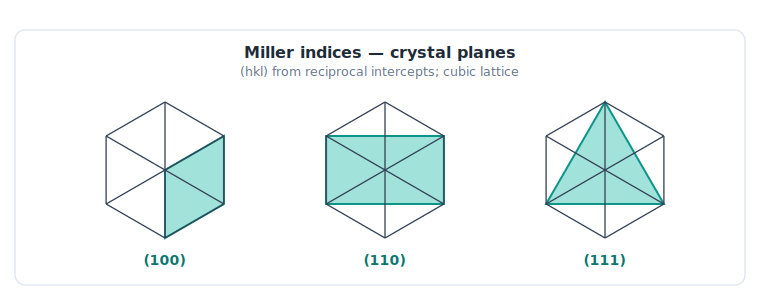
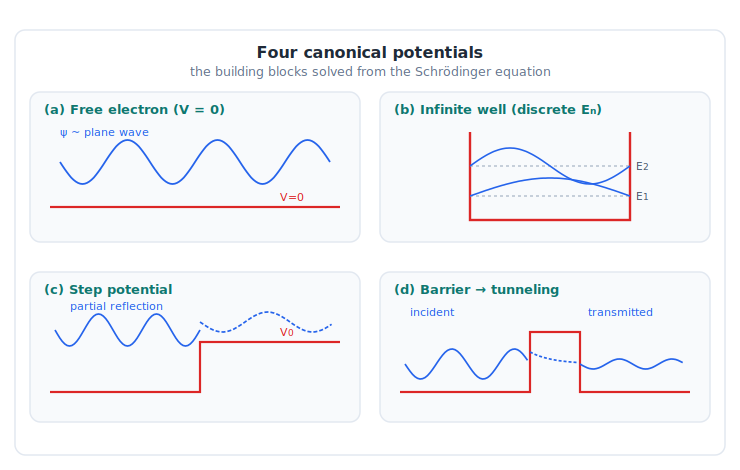
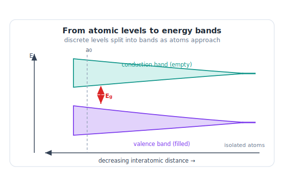
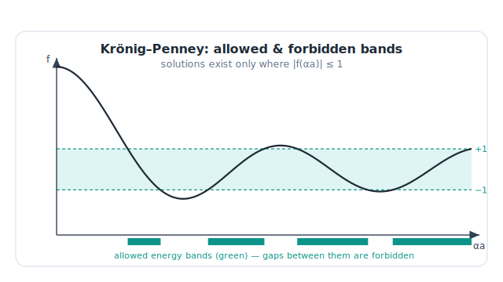
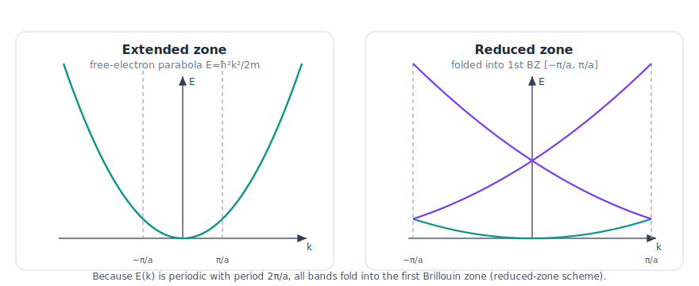
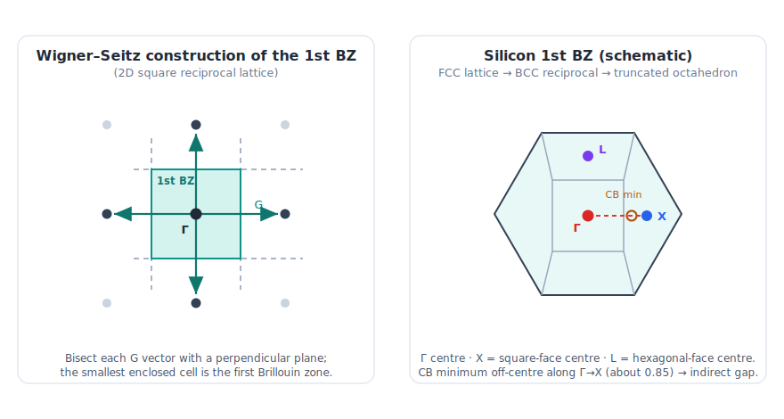
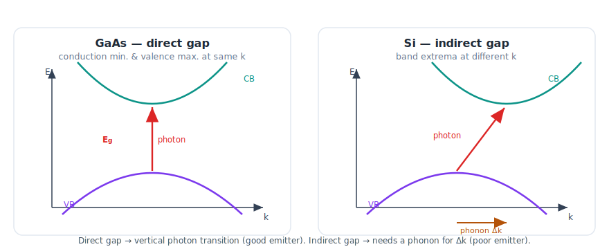

# LELEC2330 — Opto-electronic and Power Devices
## Lecture Notes — Intrinsic Properties of Semiconductors (I)

*Companion notes to the lecture slides. Academic year 2025–2026 — Prof. Laurent A. Francis, UCLouvain (ICTEAM Institute & Louvain School of Engineering).*
*Primary text: Neamen [Ref]; see the full **References** at the end.*

> **License.** © Laurent A. Francis, UCLouvain. These notes are released under
> [CC BY-SA 4.0](https://creativecommons.org/licenses/by-sa/4.0/). You may share and
> adapt them with attribution, under the same license. Textbook figures and third-party
> images from the original slides are **not** included and remain under their own
> copyright.

---

### How to read these notes

These notes follow the lecture in four movements: **(0) why silicon**, **(1) the crystal**, **(2) one quantum particle**, and **(3) many particles → energy bands**. A single pair of devices runs through the whole story as a *guiding thread*:

> **Solar cell** (crystalline silicon) — converts light into current.
> **LED** (GaAs, GaN) — converts current into light.
>
> Keep asking: *why can the same equations explain both, yet silicon is a good solar cell but a poor light emitter?* The answer only becomes clear in §3 (direct vs. indirect gap).

---

## 0. Introduction — electrons, the periodic table, and silicon

**Electrons are fermions.** They obey Fermi–Dirac statistics, carry half-integer spin (±1/2), and respect the **Pauli exclusion principle**: no two electrons can occupy the same quantum state simultaneously. This single rule is the hidden engine of the whole course — it is why discrete atomic levels must *split into bands* when atoms are brought together (§3), and why those bands fill up only to a certain level.

**Why silicon?** About 95 % of the photovoltaic market is crystalline silicon. Understanding its crystal structure and its band structure is the first step to understanding how sunlight becomes current. Silicon is a group-IV element (4 valence electrons), which is what allows the tetrahedral covalent bonding we meet in §1.

---

## 1. Crystalline structures (Chapter 1)

### 1.1 Three degrees of order

| Type | Order | Characteristic |
|------|-------|----------------|
| **Amorphous** | none | disordered atomic positions (e.g. a-Si) |
| **Polycrystalline** | short-range | ordered grains separated by grain boundaries |
| **Single / monocrystalline** | long-range | one orientation throughout; well-defined crystallographic directions |

Device-grade semiconductors are usually **single crystals**: the long-range periodicity is exactly what makes a *band structure* meaningful.

### 1.2 Lattice, unit cell, and the cubic family

A crystal is a **lattice** (a periodic set of points) decorated by a **basis** (the atoms attached to each point). The smallest repeating block is the **primitive unit cell**. The three cubic cells to know:

- **Simple cubic (SC)** — atoms at the corners only.
- **Body-centered cubic (BCC)** — corners + one atom at the body center.
- **Face-centered cubic (FCC)** — corners + one atom at each face center.

### 1.3 Miller indices — naming planes and directions

Crystal planes are labelled by **Miller indices** $(hkl)$, obtained from the reciprocals of the intercepts of the plane with the crystal axes. The most-used low-index planes are $(100)$, $(110)$, $(111)$.

- **Planes** use round brackets: $(hkl)$.
- **Directions** use square brackets: $[hkl]$, normal to the plane of the same indices in a cubic system.

Why this matters in practice: etch rates, cleavage, surface-state density and mobility all depend on orientation — e.g. silicon MOS technology is built on a specific surface orientation.

*The (100), (110) and (111) planes shaded in a cubic cell. Original figure.*

### 1.4 The semiconductor crystal structures

- **Diamond structure** — two interpenetrating FCC sublattices, every atom tetrahedrally coordinated (**coordination number 4**). This is the structure of **Si** and **Ge**.
- **Zinc-blende structure** — same geometry as diamond but the two sublattices carry *different* atoms (e.g. **GaAs**, **GaP**, **InAs**). Cubic.
- **Wurtzite structure** — the hexagonal counterpart (e.g. **GaN**, **ZnO**, **AlN**).

| Material | Structure | Main application |
|----------|-----------|------------------|
| Si | Diamond | Solar cells, CMOS |
| GaAs | Zinc-blende | LEDs, lasers |
| GaN | Wurtzite | Blue LEDs, power electronics |

> **Guiding thread.** Changing the atoms *and* the lattice (Si → GaAs → GaN) changes the entire optical behaviour. The reason is not the geometry itself but the **band structure** the geometry produces (§3).

### 1.5 Defects and impurities

Real crystals are not perfect:

- **Point/line defects** — e.g. **line dislocations**, where a row of atoms is not properly bound to the lattice. Dislocations act as non-radiative recombination centres and degrade device performance.
- **Impurities** — foreign atoms, either unwanted (contamination) or deliberate (**doping**, covered in the next lecture). A single substitutional impurity in an otherwise ordered lattice is the microscopic basis of doping.

---

## 2. Quantum description of a single particle (Chapter 2)

The goal of this chapter is to build, step by step, the equation that governs an electron: the **Schrödinger equation**. We then solve it for the simple potentials that model real device situations.

### 2.1 Light is quantized — the photoelectric effect

Light ejects electrons from a metal only above a threshold frequency. The energy balance is

$$E_{\text{kin}} = h\nu - \Phi,$$

where $\Phi$ is the **work function** (minimum energy to free an electron) and $h = 6.626\times10^{-34}\ \text{J·s}$ is **Planck's constant**. Energy comes in quanta $h\nu$ — **photons**.

### 2.2 Wave–particle duality — de Broglie

If light (a wave) carries momentum like a particle,

$$p_{\text{photon}} = \frac{h}{\lambda} = \frac{E}{c},$$

then a particle of momentum $p$ must carry a wave of wavelength (the **de Broglie wavelength**)

$$\boxed{\lambda = \frac{h}{p}}.$$

The Compton effect confirms the photon momentum; de Broglie's hypothesis makes matter wave-like. Every electron in a crystal is therefore both particle and wave.

### 2.3 Heisenberg's uncertainty principle

Position and momentum cannot both be known exactly:

$$\Delta x \,\Delta p \;\geq\; \frac{\hbar}{2}, \qquad \hbar = \frac{h}{2\pi}.$$

**Consequence for devices.** An electron is *not* a classical point particle; we can only speak of the **probability** of finding it somewhere. This is exactly why:
- semiconductors have **energy bands** rather than orbits,
- LEDs emit at **specific wavelengths**,
- solar cells absorb only photons **above a threshold energy** (the gap).

### 2.4 Wavefunction and probability density

A "classical" wave is written

$$\psi(x,t) = A\,e^{i(kx-\omega t)}, \qquad k = \text{wavenumber}.$$

A matter wave of definite energy and momentum is described by a **wavefunction** $\Psi(x,t)$ with

$$E = \hbar\omega, \qquad p = \hbar k.$$

(The single plane wave is one *eigenstate* — §3 explains why.) Its physical meaning, due to Born:

$$|\Psi(x,t)|^2 = \text{probability density of finding the particle at } x.$$

**Criteria a valid pdf must satisfy:**
1. Normalization: $\displaystyle\int_{-\infty}^{+\infty} |\Psi|^2\,dx = 1$.
2. $\Psi$ single-valued, finite, continuous.
3. $\partial\Psi/\partial x$ continuous — **except** where the potential is infinite (this exception appears in the infinite well).

### 2.5 From operators to the Schrödinger equation

The momentum and energy are promoted to **operators** (hat notation):

$$\hat{p} = -i\hbar\,\frac{\partial}{\partial x}, \qquad \hat{E} = i\hbar\,\frac{\partial}{\partial t}.$$

Substituting into the classical energy relation $E = p^2/2m + V$ acting on $\Psi$ gives the **time-dependent Schrödinger equation**:

$$i\hbar\,\frac{\partial \Psi}{\partial t} = -\frac{\hbar^2}{2m}\frac{\partial^2 \Psi}{\partial x^2} + V(x)\,\Psi.$$

> ⚠️ **Notation reminder:** here $V$ is a **potential energy in joules**, not a voltage in volts.

In compact form, introduce the **Hamiltonian** operator (total energy = kinetic + potential):

$$\hat{H} = -\frac{\hbar^2}{2m}\nabla^2 + V, \qquad i\hbar\,\frac{\partial\Psi}{\partial t} = \hat{H}\Psi.$$

In 3D, $\nabla^2$ is the **Laplacian** $\big(\partial_x^2+\partial_y^2+\partial_z^2\big)$.

### 2.6 Separation of variables → time-independent equation

For a time-independent potential, write $\Psi(x,t) = \psi(x)\,\phi(t)$. The time part is

$$\phi(t) = e^{-iEt/\hbar},$$

and the spatial part obeys the **time-independent Schrödinger equation** (an eigenvalue problem, $\hat{H}\psi = E\psi$):

$$-\frac{\hbar^2}{2m}\frac{d^2\psi}{dx^2} + V(x)\,\psi = E\,\psi.$$

The allowed energies $E$ are the **eigenvalues**; the corresponding $\psi$ are the **eigenstates**.

### 2.7 The four canonical potentials

Solving the time-independent equation for simple $V(x)$ gives the textbook cases:

1. **Free electron** ($V=0$). Solutions are travelling plane waves; *any* energy is allowed (continuous spectrum). → leads directly to the parabolic dispersion of §3.
2. **Infinite potential well** (width $L$). Energy is **quantized**:
   $$E_n = \frac{n^2\pi^2\hbar^2}{2mL^2}, \qquad \psi_n(x) = \sqrt{\tfrac{2}{L}}\,\sin\!\frac{n\pi x}{L}, \quad n=1,2,\dots$$
   Confinement → discrete levels. This is the seed of quantum-well lasers.
3. **Step potential** — partial reflection/transmission even when $E > V$; a purely wave phenomenon.
4. **Potential barrier** — the wavefunction is non-zero *inside* and *beyond* a barrier even when $E < V$: **quantum tunneling**.

*The four canonical potentials and their wavefunctions: free electron, infinite well (discrete levels), step, and barrier (tunneling). Original figure.*

### 2.8 Tunneling in real devices

Tunneling is not a curiosity — it is engineered into:
- **tunnel diodes**,
- **flash memory** (charge tunnels onto/off the floating gate),
- **ultra-scaled MOSFETs** (gate leakage — a problem to fight),
- **tunnel junctions in multijunction / tandem solar cells**,
- **quantum-well lasers**.

### 2.9 The real crystal is a many-body problem

A crystal has $N$ nuclei (mass $M_j$, position $\mathbf{R}_j$) and $P$ electrons (mass $m$, position $\mathbf{r}_i$), all interacting through a Coulomb potential $V$. The exact Hamiltonian couples *every* particle to *every* other — impossible to solve directly.

**The way out:** approximations such as **Hartree–Fock**, which replace the intractable system by a tractable picture:

> neutral crystal ≈ **ions (fixed cores)** + **quasi-free electrons** moving in an effective *periodic* potential.

This independent-electron-in-a-periodic-potential picture is exactly what Chapter 3 solves.

---

## 3. Band structure (Chapter 3)

### 3.1 Why discrete levels become bands

Take two hydrogen atoms. Each isolated atom has a discrete $n=1$ level. Bring them close: their probability densities **overlap**, and Pauli forbids identical states — so the single level must **split into two**. Bring $N$ atoms together (a crystal) and each discrete level splits into $N$ closely spaced levels: an **energy band**.

> **Key idea (Pauli at work).** Joining atoms into a crystal does *not* change the total number of quantum states — but those states must redistribute into **bands** so that every electron sits in a distinct state. Between bands there can be ranges of energy with **no allowed states** — the **forbidden gaps**.

Bands that are completely or partially filled with valence electrons are the **valence bands**. In group-IV semiconductors, $sp^3$ **hybridization** of the four valence electrons produces the bonding/antibonding bands separated by the gap.

*As atoms approach, each discrete level splits and broadens into a band; a gap E_g remains at the equilibrium spacing a0. Original figure.*

### 3.2 Bloch's theorem

In a periodic potential, the eigenstates are plane waves **modulated by a function with the lattice periodicity**:

$$\psi_k(x) = u_k(x)\,e^{ikx}, \qquad u_k(x+a) = u_k(x).$$

This is the central simplification: it reduces the infinite crystal to a problem over a single unit cell, parametrized by the wavevector $k$. The energy-versus-wavevector relation $E(k)$ is the **dispersion relation** — the object we want.

### 3.3 The Kronig–Penney model (1D)

Model the crystal as a periodic train of rectangular barriers. Imposing Bloch's theorem and continuity yields a **transcendental relation**:

$$P\,\frac{\sin(\alpha a)}{\alpha a} + \cos(\alpha a) = \cos(ka), \qquad \alpha = \frac{\sqrt{2mE}}{\hbar},$$

where $P$ measures the **transparency / strength of the barriers**. Because the left side can exceed $\pm 1$ while $\cos(ka)$ cannot, only certain energy ranges have solutions → **allowed and forbidden bands** emerge naturally.

**Two limiting cases** (the physical bracket the real crystal lives between):

- $P \to 0$ — transparent barriers → **free electron**, continuous parabola.
- $P \to \infty$ — opaque barriers → isolated wells → **discrete quantized levels**.

Electrons in a real crystal sit **between** these extremes: a *deformed* parabola with gaps.

*Allowed energy bands occur only where |f(αa)| ≤ 1; the intervals outside the band are the forbidden gaps. Original figure.*

### 3.4 Free-electron reference (Sommerfeld)

For the free electron the dispersion is the simple parabola

$$E = \frac{\hbar^2 k^2}{2m}.$$

This is the baseline against which the crystal's deformations and gaps are read.

### 3.5 Phase velocity, group velocity, and wave packets

- **Phase velocity** — speed of a single eigenstate: $\displaystyle v_p = \frac{\omega}{k}$.
- **Group velocity** — speed of a *packet* of eigenstates (the physical particle velocity):
  $$v_g = \frac{d\omega}{dk} = \frac{1}{\hbar}\frac{dE}{dk}.$$

A localized electron is a **wave packet** built from many $k$; in a dispersive medium ($E$ not $\propto k$) the packet spreads. The group velocity — the *slope* of $E(k)$ — is what carries current. (The *curvature* of $E(k)$ defines the **effective mass** $m^*$ via $1/m^* = (1/\hbar^2)\,d^2E/dk^2$ — the bridge to the next lecture on transport.)

### 3.6 Reduced-zone representation

Because $E(k)$ is periodic in $k$ with period $2\pi/a$, all the information lives in one period: the **reduced-zone scheme**. Folding the bands back into this interval gives the familiar stacked-band $E(k)$ picture (allowed bands separated by gaps), with a parallel real-space view $E(x)$.

*The free-electron parabola (extended zone, left) folds into the first Brillouin zone (reduced zone, right). Original figure.*

### 3.7 Density of states (DOS)

How many states are available per unit energy? For a crystal of volume $V$, the 3D **density of states** is

$$g(E) \propto \frac{V}{2\pi^2}\left(\frac{2m}{\hbar^2}\right)^{3/2}\sqrt{E}.$$

Two points worth holding onto:
- The factor $\sqrt{E}$ (in 3D) sets the shape near a band edge.
- A factor of **2 for spin** multiplies the count — the Pauli/spin thread from §0 reappearing.

DOS will be combined with the occupation statistics (Fermi–Dirac) in the next lecture to get **carrier concentrations**.

### 3.8 Building the Brillouin zone

The natural arena for $E(k)$ is **reciprocal (k-) space**. The **first Brillouin zone (BZ)** is the
fundamental cell of that space; it is built in three steps.

**Step 1 — The reciprocal lattice.** From the direct-lattice primitive vectors
$\mathbf a_1,\mathbf a_2,\mathbf a_3$, define the **reciprocal primitive vectors** by the duality
condition $\mathbf b_i\cdot\mathbf a_j=2\pi\,\delta_{ij}$, i.e.

$$\mathbf b_1=2\pi\,\frac{\mathbf a_2\times\mathbf a_3}{\mathbf a_1\cdot(\mathbf a_2\times\mathbf a_3)},
\quad\text{and cyclic for } \mathbf b_2,\mathbf b_3 .$$

The $\mathbf b_i$ generate the **reciprocal lattice** — the set of wavevectors $\mathbf G$ for which
$e^{i\mathbf G\cdot\mathbf R}=1$ on every direct-lattice point $\mathbf R$. This is the lattice on
which $\mathbf k$ lives. A useful fact: under this map an **FCC** direct lattice becomes **BCC** in
reciprocal space, and a **BCC** direct lattice becomes **FCC**.

**Step 2 — The Wigner–Seitz construction (in k-space).** Pick a reciprocal-lattice point as origin.
Draw the vectors $\mathbf G$ to all *neighbouring* reciprocal-lattice points and bisect each one with
a **perpendicular plane**. The smallest volume around the origin enclosed by these planes is the
**first Brillouin zone** — by construction the **Wigner–Seitz cell of the reciprocal lattice**. (The
same recipe applied in *real* space gives the ordinary Wigner–Seitz cell of §1.2.)

**Step 3 — Why those bisecting planes matter.** They are exactly the **Bragg planes**: a wave whose
$\mathbf k$ reaches a zone boundary satisfies the Bragg condition, is reflected, and forms a standing
wave. This is precisely where the **group velocity vanishes** (§3.5) and where the **energy gaps
open** (§3.3, §3.6). The BZ boundary is therefore not an arbitrary box but the *locus of Bragg
reflection* — which is why all the interesting band physics happens at its edges and why the
reduced-zone scheme folds everything back inside it.

**Shapes, and silicon.** The BZ shape follows from the reciprocal lattice: simple-cubic → cubic BZ;
BCC direct → FCC reciprocal → **rhombic-dodecahedron** BZ; FCC direct → BCC reciprocal →
**truncated-octahedron** BZ. **Silicon** (diamond = FCC lattice) thus has a truncated-octahedron BZ.
Band structures are plotted along high-symmetry directions joining special points — $\Gamma$ (zone
centre), $X$ (centre of a square face), $L$ (centre of a hexagonal face). Silicon's conduction-band
minimum lies **along $\Gamma\!\to\!X$** (about 85 % of the way to $X$) while its valence-band maximum
is at $\Gamma$ → an **indirect** gap; in **GaAs** both extrema sit at $\Gamma$ → a **direct** gap
(§3.10). The BZ is also the finite $\mathbf k$-volume over which the density of states (§3.7) is
counted.

*Left: the first Brillouin zone is the smallest cell enclosed by the perpendicular bisectors of the
reciprocal-lattice vectors **G** (Wigner–Seitz cell). Right: silicon's truncated-octahedron zone,
with the conduction-band minimum off-centre along Γ→X (indirect gap). Schematic, original figure.*

### 3.9 Computing real 3D band structures

1D Kronig–Penney is solvable by hand; real 3D crystals need numerical methods:
- **Tight-binding / LCAO** (linear combination of atomic orbitals),
- **Cellular (Wigner–Seitz) method**,
- **Augmented-plane-wave (APW) method**,
- **Pseudopotential method**.

### 3.10 The payoff — direct vs. indirect gap

This is the slide everything was built for.

| | **Silicon** | **GaAs** |
|---|---|---|
| Gap type | **Indirect** | **Direct** |
| Band extrema | conduction min. and valence max. at **different** $k$ | at the **same** $k$ |
| Light absorption | acceptable | excellent |
| Light emission | **poor** | **efficient** |

**Why.** An optical transition must conserve both **energy** and **crystal momentum** $k$. A photon carries energy but almost no momentum. So:
- In a **direct-gap** material (GaAs), an electron can drop from conduction to valence band emitting a photon *directly* — efficient **light emission** → LEDs and lasers.
- In an **indirect-gap** material (Si), emission requires the *additional* help of a **phonon** to supply the momentum mismatch — a much less likely (slower, mostly non-radiative) process. Silicon is a **poor emitter** but still **absorbs** acceptably, which is why it makes a fine **solar cell** but not a good LED.

> **The whole guiding thread, in one line:** the *position in k-space* of the band extrema — i.e. the **nature of the gap** — decides whether a semiconductor prefers to **absorb** (solar cell) or **emit** (LED) light.

---

*Direct gap (GaAs): vertical photon transition. Indirect gap (Si): the offset minimum needs a phonon for Δk. Original figure.*

## 4. Take-home messages

- **Electrons are fermions**; their behaviour is a wavefunction governed by the **Schrödinger equation**.
  - No potential → **Sommerfeld** free electron: continuous, parabolic $E(k)$.
  - Periodic potential → **Kronig–Penney**: deformed parabola with **forbidden gaps**.
- **Semiconductors are periodic crystals**; the **Hartree–Fock** picture treats them as **ions + quasi-free electrons**.
- The **band structure** is best read in **reciprocal (k-) space / the Brillouin zone**.
  - 1D: Kronig–Penney, solvable by hand.
  - 3D: needs numerical methods (tight-binding, pseudopotential, …).
- **Pauli + periodicity → bands and gaps.** The **type of gap (direct/indirect)** governs optical behaviour.

### Guiding examples — recap
- **Solar cell:** silicon is a diamond-structure crystal; electrons fill bands; **absorption** depends on the band structure. Silicon's indirect gap is acceptable for absorption.
- **LED:** materials like GaAs have a **direct** gap, allowing efficient radiative transitions → **emission**.

### What comes next (Intrinsic Properties II)
How **charge carriers move** inside these materials (transport, effective mass) and how to determine their **concentrations** (DOS × Fermi–Dirac statistics, intrinsic carrier density).

---

## Quick-reference equation sheet

| Concept | Relation |
|---|---|
| Photoelectric effect | $E_{\text{kin}} = h\nu - \Phi$ |
| de Broglie wavelength | $\lambda = h/p$ |
| Photon momentum | $p = h/\lambda = E/c$ |
| Heisenberg | $\Delta x\,\Delta p \geq \hbar/2$ |
| Born rule | $P(x) = \lvert\Psi(x)\rvert^2$, $\int\lvert\Psi\rvert^2dx=1$ |
| Operators | $\hat p=-i\hbar\,\partial_x$, $\hat E=i\hbar\,\partial_t$ |
| Time-dependent SE | $i\hbar\,\partial_t\Psi = \hat H\Psi$ |
| Hamiltonian | $\hat H = -\dfrac{\hbar^2}{2m}\nabla^2 + V$ |
| Time-independent SE | $-\dfrac{\hbar^2}{2m}\psi'' + V\psi = E\psi$ |
| Infinite well | $E_n = \dfrac{n^2\pi^2\hbar^2}{2mL^2}$ |
| Bloch theorem | $\psi_k = u_k(x)e^{ikx}$, $u_k$ periodic |
| Kronig–Penney | $P\,\dfrac{\sin\alpha a}{\alpha a}+\cos\alpha a=\cos ka$ |
| Free electron | $E = \dfrac{\hbar^2 k^2}{2m}$ |
| Group velocity | $v_g = \dfrac{1}{\hbar}\dfrac{dE}{dk}$ |
| Effective mass | $\dfrac{1}{m^*}=\dfrac{1}{\hbar^2}\dfrac{d^2E}{dk^2}$ |
| DOS (3D) | $g(E)\propto \sqrt{E}$, $\times 2$ for spin |

---

## Glossary

- **Basis / lattice / unit cell** — atoms attached to each lattice point / periodic point set / smallest repeating block.
- **Miller indices $(hkl)$** — reciprocal-intercept labels for crystal planes; $[hkl]$ for directions.
- **Coordination number** — number of nearest neighbours (4 in the diamond/zinc-blende tetrahedron).
- **Work function $\Phi$** — minimum energy to extract an electron from a solid.
- **Eigenstate / eigenvalue** — allowed wavefunction / its energy in the Schrödinger equation.
- **Dispersion relation $E(k)$** — energy versus wavevector; the fingerprint of a band structure.
- **Brillouin zone** — primitive cell of the reciprocal lattice (Wigner–Seitz cell in k-space).
- **Density of states $g(E)$** — number of available states per unit energy.
- **Direct / indirect gap** — conduction-band minimum and valence-band maximum at the same / different $k$.

---

## References

- **[Ref]** D. A. Neamen, *Semiconductor Physics and Devices: Basic Principles*, 4th ed.,
  McGraw-Hill, 2012. ISBN 978-0-07-352958-5.
- **[1]** K. W. Böer & U. W. Pohl, *Semiconductor Physics*, Springer International Publishing, 2018.
  https://doi.org/10.1007/978-3-319-69150-3
