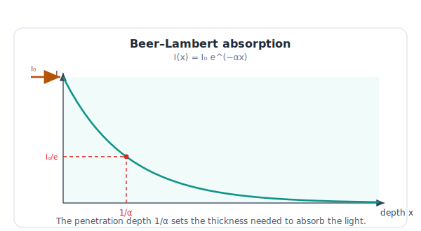
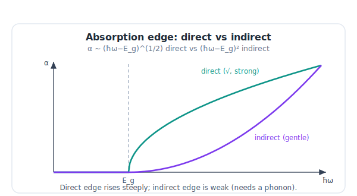
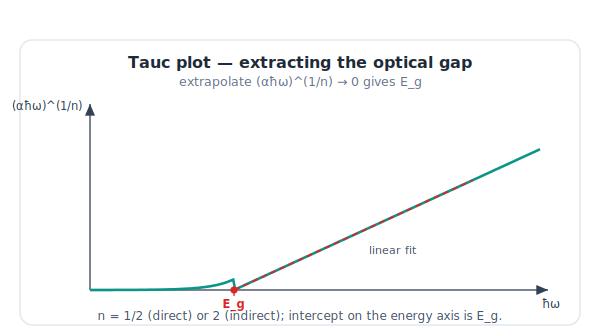
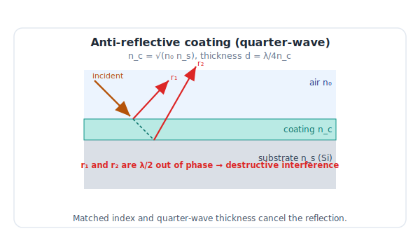
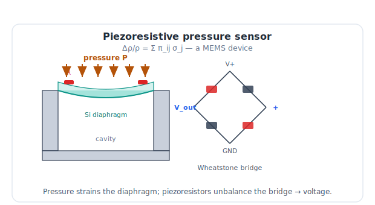

# LELEC2330 — Opto-electronic and Power Devices
## Lecture Notes — Intrinsic Properties of Semiconductors (III)

*Companion notes to the lecture slides. Prof. Laurent A. Francis, UCLouvain (ICTEAM Institute & Louvain Engineering School).*
*Primary text: Böer & Pohl [7] and Grundmann [4]; see the full **References** at the end.*

> **License.** © Laurent A. Francis, UCLouvain. Released under
> [CC BY-SA 4.0](https://creativecommons.org/licenses/by-sa/4.0/). Share and adapt with
> attribution, under the same license. Textbook figures and third-party images from the
> original slides are **not** included and remain under their own copyright.

---

### How to read these notes

Lectures I–II built the **electronic** structure (bands) and **transport** (carriers, mobility).
Lecture III turns to **light–matter interaction**: how a semiconductor absorbs and emits photons.
Six movements: **(1)** electromagnetic and dielectric foundations; **(2)** reflection at interfaces
and how we measure optical constants (ellipsometry); **(3)** dispersion and the dielectric function
(Kramers–Kronig); **(4)** band-to-band optical transitions and the absorption/emission spectrum;
**(5)** anti-reflective coatings and light management; **(6)** strain effects and piezoresistivity.

> **Guiding thread.** One chapter, two devices, the same physics read in opposite directions.
> **Solar cell** (Si): *absorbs* photons → electron–hole pairs. Goal: **capture every incident photon**.
> **LED** (GaAs/GaN): free carriers *recombine* → photons. Goal: **get every generated photon out**.
> A photon with $\hbar\omega \ge E_g$ is absorbed; an LED emits at $\hbar\omega \approx E_g$.

---

## 1. Electromagnetic and dielectric foundations

### 1.1 Maxwell's equations

All optical behaviour follows from Maxwell's equations. In a medium with relative permittivity
$\varepsilon$, relative permeability $\mu$ and conductivity $\sigma$:

$$\nabla\times\mathbf E=-\mu\mu_0\frac{\partial \mathbf H}{\partial t},\qquad
\nabla\times\mathbf H=\varepsilon\varepsilon_0\frac{\partial \mathbf E}{\partial t}+\sigma\mathbf E,$$
$$\nabla\cdot(\varepsilon\varepsilon_0\mathbf E)=\rho,\qquad \nabla\cdot\mathbf H=0.$$

The visible range spans roughly **1.8 eV (red) to 3.1 eV (violet)** — the window in which photovoltaics
and LEDs operate.

### 1.2 Non-absorbing dielectric: refractive index

With no losses ($\sigma=0$), combining the curl equations gives the undamped **wave equation**; its
plane-wave solutions travel at $v=c/n_r$, where the **refractive index** is

$$n_r=\sqrt{\varepsilon\mu}\;\approx\;\sqrt{\varepsilon}\qquad(\mu\approx 1).$$

### 1.3 Absorbing medium: complex index and dielectric function

Real semiconductors absorb, so both the index and the permittivity become **complex**:

$$\tilde n=n_r+i\kappa,\qquad \tilde\varepsilon=\varepsilon_1+i\varepsilon_2,\qquad \tilde\varepsilon=\tilde n^2,$$

where $\kappa$ is the **extinction coefficient**. Expanding $\tilde n^2$:

$$\varepsilon_1=n_r^2-\kappa^2,\qquad \varepsilon_2=2 n_r\kappa.$$

A wave then propagates as $E\propto e^{-\kappa\omega x/c}\,e^{i\omega(n_r x/c-t)}$ — the imaginary part
$\kappa$ produces **attenuation**.

### 1.4 Absorption coefficient and the Beer–Lambert law

The intensity (energy density) decays exponentially with depth — the **Beer–Lambert law**:

$$I(x)=I_0\,e^{-\alpha x},\qquad \boxed{\;\alpha=\frac{2\omega\kappa}{c}=\frac{4\pi\kappa}{\lambda}\;}$$

The **penetration (absorption) depth** $\delta=1/\alpha$ is the distance over which intensity falls to
$1/e$.

> **Guiding thread · solar cell.** $1/\alpha$ sets the **minimum thickness** a cell needs to capture the
> incident light — a core design driver. Silicon's indirect, weak band-edge absorption means
> $1/\alpha$ is large near the gap, forcing either a thick cell or **light trapping** (§5).

*Beer–Lambert decay I=I₀e^{−αx}; the penetration depth 1/α is where intensity falls to I₀/e. Original figure.*

### 1.5 Complex conductivity and the dielectric tensor

Fourier-transforming Maxwell's equation $\nabla\times\mathbf H=\varepsilon\varepsilon_0\,\partial_t\mathbf E+\sigma\mathbf E$
in time ($\partial_t\to-i\omega$) merges the bound (displacement) and free (conduction) responses into a
single **complex conductivity** $\tilde\sigma(\omega)$, equivalently a single complex
$\tilde\varepsilon(\omega)$. In anisotropic crystals $\varepsilon$ is a **tensor**, so optical response can
depend on orientation and polarization.

---

## 2. Reflection, interfaces and ellipsometry

### 2.1 Geometry and polarization

At a flat interface ($z=0$) between medium 1 (incident) and medium 2 (transmitted), the field is split
into two polarizations: **p** (parallel to the plane of incidence) and **s** (*senkrecht*, perpendicular).

### 2.2 Snell's law and the critical angle

Matching the tangential phase of the three waves gives **Snell's law**:

$$n_1\sin\theta_i=n_2\sin\theta_t.$$

When $n_1>n_2$, total internal reflection sets in beyond the **critical angle**
$\sin\theta_c=n_2/n_1$ — central to waveguiding and to **light extraction** from high-index LEDs.

### 2.3 Fresnel equations, reflectance and transmittance

Continuity of the tangential field amplitudes yields the **Fresnel coefficients** $r_{p,s}$, $t_{p,s}$.
The measurable **reflectance** $R$ and **transmittance** $T$ are ratios of energy flux (Poynting vector),
with $R+T=1$ for a non-absorbing interface. At **normal incidence** between air and a medium $\tilde n$:

$$R=\left\lvert\frac{1-\tilde n}{1+\tilde n}\right\rvert^2
=\frac{(n_r-1)^2+\kappa^2}{(n_r+1)^2+\kappa^2}.$$

### 2.4 Brewster angle and polarization

At the **Brewster angle** $\tan\theta_B=n_2/n_1$, the p-polarized reflection vanishes, so reflected light
is fully s-polarized. For an absorbing semiconductor the minimum is shallow — a **pseudo-Brewster
angle** — but still yields quasi-linearly polarized light.

> **Guiding thread · solar cell.** Bare silicon reflects **~30 %** of sunlight at normal incidence
> (because $n_r\approx 3.9$). An anti-reflective coating or texturing recovers most of it (§5).

### 2.5 Thin slab: multiple reflections and interference

In a transparent slab, the beam reflects back and forth and the partial waves **interfere**. The fringe
spacing depends on $n_r$ and thickness $d$, which is why slab interference is used to **measure film
thickness** (known $n_r$) or **the index** (known $d$); with roughening or polychromatic light it also
yields $\alpha$ and the base reflectance $R_0$.

### 2.6 Ellipsometry

**Ellipsometry** measures the *ratio* of the p and s Fresnel coefficients near the Brewster angle, with
linearly polarized incident light:

$$\rho=\frac{r_p}{r_s}=\tan\Psi\,e^{i\Delta}.$$

Because it measures an **amplitude ratio and a phase difference** $(\Psi,\Delta)$ rather than an absolute
intensity, ellipsometry is highly accurate and self-referencing. If medium 1 is known, $\tilde n$ (or a
film thickness) is extracted; **spectroscopic ellipsometry** sweeps wavelength to obtain
$\tilde n(\lambda)$ and $\tilde\varepsilon(\lambda)$ — the standard thin-film metrology in cleanrooms
(e.g. WINFAB tools).

---

## 3. Dispersion and the dielectric function (Kramers–Kronig)

### 3.1 From microscopic polarizability to $\varepsilon$

The medium's response begins with atomic/ionic **polarizability**. The **Clausius–Mossotti relation**
links the macroscopic $\varepsilon$ to the microscopic polarizability (and, for binary compounds, to the
two sublattices). An applied field induces a **polarization** $\mathbf P=\varepsilon_0\chi\mathbf E$, with
**susceptibility** $\chi$; in frequency space $\tilde\varepsilon(\omega)=1+\tilde\chi(\omega)$.

### 3.2 Kramers–Kronig relations

Because the response is **causal** (no polarization before the field arrives), the real and imaginary
parts of $\tilde\varepsilon(\omega)$ are not independent — they are **Hilbert transforms** of each other,
the **Kramers–Kronig relations**:

$$\varepsilon_1(\omega)-1=\frac{2}{\pi}\,\mathcal P\!\!\int_0^\infty
\frac{\omega'\,\varepsilon_2(\omega')}{\omega'^2-\omega^2}\,d\omega',$$

and a reciprocal expression for $\varepsilon_2$ in terms of $\varepsilon_1$ ($\mathcal P$ = principal
value). Practically: **measure absorption ($\varepsilon_2$) over a wide spectrum and you can compute the
dispersion of the index ($\varepsilon_1$)**, and vice versa. This is what makes a single ellipsometry or
absorption dataset so powerful.

---

## 4. Optical transitions: absorption and emission

### 4.1 Band-to-band transitions and the momentum matrix

Absorption promotes an electron from a filled valence state to an empty conduction state at (essentially)
the **same wavevector $k$** (a photon carries negligible momentum). The number of such transitions is set
by the **momentum matrix element** $\langle \mu|\,\mathbf e\cdot\mathbf p\,|\mu'\rangle$ between the two
bands ($\mathbf e$ = light polarization). Where this element is large the transition is **allowed**; where
it vanishes by symmetry it is **forbidden**.

### 4.2 Fermi's golden rule

The quantum transition rate from an initial state into a continuum of final states is **Fermi's golden
rule**:

$$W=\frac{2\pi}{\hbar}\,\lvert M\rvert^2\,\delta\!\left(E_f-E_i-\hbar\omega\right),$$

where $M$ is the matrix element and the **Dirac $\delta$** enforces energy conservation.

### 4.3 Joint density of states and Van Hove singularities

Summing the golden rule over all $k$ introduces the **joint density of states (JDOS)** between the two
bands:

$$J(\hbar\omega)\propto\int\frac{dS}{\lvert\nabla_k\!\left(E_c-E_v\right)\rvert},$$

an integral over the constant-energy surface. Where the conduction and valence bands are **parallel**
($\nabla_k(E_c-E_v)=0$), the JDOS diverges — these are the **Van Hove singularities** (critical points)
that produce the sharp peaks in measured absorption spectra (e.g. in Ge). Their dimensionality sets the
line shape (3D → $M$, 2D → $P$, 1D → $Q$ type).

### 4.4 Direct vs indirect absorption edge

The shape of the absorption edge depends on the gap type:

- **Direct gap** (allowed): photon-only vertical transition →
  $$\alpha(\hbar\omega)\propto(\hbar\omega-E_g)^{1/2}.$$
- **Indirect gap**: needs a **phonon** to supply $\Delta k$, so absorption is weaker and starts more
  gradually →
  $$\alpha(\hbar\omega)\propto(\hbar\omega-E_g\pm E_{\text{phonon}})^{2}.$$

Indirect-gap semiconductors include **Si, Ge, GaP, AlAs, AlSb**; most others are direct.

> **Guiding thread · solar cell.** Only photons with $\hbar\omega\ge E_g$ make pairs; sub-gap light is
> transmitted and **lost**. Silicon's indirect edge gives weak band-edge absorption → cells must be
> **thick or use light trapping**.

*Absorption edge: a direct gap rises steeply (∝√(ħω−E_g)); an indirect gap is weak and gradual (∝(ħω−E_g)²). Original figure.*

### 4.5 Emission: spontaneous luminescence

Run the process backwards: an electron–hole pair **recombines** and emits a photon with
$\hbar\omega\approx E_g$ (spontaneous emission / luminescence). Efficient radiative recombination needs a
**direct gap** — which is why III–V materials (GaAs, GaN) make good LEDs and **indirect silicon barely
emits**.

### 4.6 Band gap vs lattice constant — choosing the colour

For LEDs the **emission colour** is set by $E_g$, tuned by alloying (e.g. AlGaAs, InGaN). But the alloy
must remain **lattice-matched** to the substrate for defect-free, non-radiative-recombination-free growth
— hence the classic **band-gap-vs-lattice-constant** map used to design emitters.

> **Guiding thread · LED.** Direct gap (III–V) for efficient emission; the alloy and gap set the colour;
> lattice-matched growth keeps it bright.

### 4.7 Allowed/forbidden transitions and valence-band structure

The detailed edge also reflects **selection rules** (allowed vs forbidden, via the momentum matrix) and
the **multiple valence bands** (light/heavy holes, split-off band from spin–orbit coupling), which is why
absorption near the edge can be polarization-dependent (e.g. CdS).

### 4.8 Amorphous semiconductors: Urbach tail and Tauc plot

Disordered materials have no sharp edge. Absorption decays **exponentially** below the gap — the
**Urbach tail**:

$$\alpha(\hbar\omega)=\alpha_0\,\exp\!\left(\frac{\hbar\omega-E_1}{E_0}\right),$$

where the **Urbach energy** $E_0$ is the width of the band edge, governed by **crystal disorder, surface
states/passivation and stoichiometry**. To extract an optical gap one uses the **Tauc plot**:

$$(\alpha\hbar\omega)\propto(\hbar\omega-E_g)^{n},\qquad n=\tfrac12\ (\text{direct}),\ 2\ (\text{indirect}),$$

and extrapolates the linear part of $(\alpha\hbar\omega)^{1/n}$ versus $\hbar\omega$ to zero. The same
optical transparency that makes **glasses** good **optical fibres** is the low-$\alpha$ window between the
Urbach edge and infrared phonon absorption.

---

*Tauc plot: extrapolating the linear part of (αħω)^{1/n} to zero gives the optical gap E_g. Original figure.*

## 5. Anti-reflective coatings and light management

### 5.1 The quarter-wave coating

A single transparent layer of index $n_c$ and thickness $d$ on a substrate $n_s$ (in air $n_0$) cancels
reflection when the two interface reflections interfere destructively. The conditions are an
**index-matching** rule and a **quarter-wave** thickness:

$$\boxed{\;n_c=\sqrt{n_0\,n_s}\;},\qquad n_c\,d=\frac{\lambda}{4}\;\Rightarrow\; d=\frac{\lambda}{4n_c}.$$

For silicon in air ($n_s\approx3.9$), the ideal $n_c\approx\sqrt{3.9}\approx2.0$ — close to the SiN$_x$
routinely used on solar cells.

*A quarter-wave ARC (n_c=√(n₀n_s)): the two interface reflections are λ/2 out of phase and cancel. Original figure.*

### 5.2 Broadband and bio-inspired light management

A single quarter-wave layer is minimal at one wavelength only. Broadband suppression uses **double-layer
coatings**, **graded-index** profiles (a smooth $n$ transition reflects nothing), and **textured /
moth-eye** surfaces — sub-wavelength structures that mimic insect eyes to give a near-continuous index
gradient. For **solar cells**, surface **texturing** both cuts reflection and traps light (longer path →
more absorption in thin Si).

### 5.3 Light extraction from LEDs

The same ideas run in reverse for **LEDs**, where the problem is getting light *out* of a high-index
semiconductor past total internal reflection. Textured surfaces, encapsulation and patterned overlayers
raise the **extraction efficiency** — including bio-inspired structures such as the *Photuris* firefly
lantern overlayer demonstrated to improve LED extraction [3].

> **Guiding thread.** ARC + texturing cut the ~30 % reflection loss of a solar cell; texturing and
> encapsulation help an LED extract its light. Same optics, opposite direction.

---

## 6. Strain and piezoresistivity

### 6.1 Strain shifts the bands

**Hydrostatic pressure** and **strain** deform the lattice and therefore the band structure — shifting
$E_g$ and, importantly, lifting **valley degeneracies** and changing band curvature. Through the effective
mass and intervalley scattering, strain **changes the mobility** — the basis of **strained silicon** in
modern CMOS, where deliberate strain boosts carrier mobility.

### 6.2 Piezoresistivity

Strain also changes the **resistivity** directly — **piezoresistivity**. The fractional change is linear
in the applied **stress** $\sigma_j$ through the **piezoresistive coefficients** $\pi_{ij}$:

$$\frac{\Delta\rho}{\rho}=\sum_j \pi_{ij}\,\sigma_j,$$

with $\pi$ of order $10^{-11}\,\text{Pa}^{-1}$ in silicon — large enough that a diffused silicon resistor
makes a sensitive strain gauge. (The coefficients are strongly **orientation-dependent**, reflecting the
many-valley band structure.)

### 6.3 Application: MEMS pressure sensor

The headline application is the **piezoresistive pressure sensor**: a thin silicon diaphragm with diffused
resistors in a Wheatstone bridge converts pressure-induced strain into a voltage — one of the oldest and
most successful MEMS devices, and a direct link from band physics to sensor engineering.

---

*Piezoresistive pressure sensor: pressure strains a silicon diaphragm; diffused piezoresistors unbalance a Wheatstone bridge. Original figure.*

## 7. Take-home messages

- Optical response is fixed by a **complex index** $\tilde n=n_r+i\kappa$ / **dielectric function**
  $\tilde\varepsilon=\tilde n^2$; the imaginary part drives **absorption**, with
  $\alpha=4\pi\kappa/\lambda$ and Beer–Lambert decay $I=I_0e^{-\alpha x}$ (depth $1/\alpha$).
- At interfaces, **Snell** + **Fresnel** give reflectance; bare Si reflects ~30 %. **Ellipsometry**
  ($\rho=r_p/r_s=\tan\Psi\,e^{i\Delta}$) measures $\tilde n(\lambda)$ accurately.
- **Causality** ties $\varepsilon_1$ and $\varepsilon_2$ through the **Kramers–Kronig** relations.
- Absorption = **band-to-band transitions** governed by **Fermi's golden rule** and the **joint density of
  states** (with **Van Hove** singularities). Edge law: $\alpha\propto(\hbar\omega-E_g)^{1/2}$ (direct)
  vs $(\hbar\omega-E_g\pm E_{\text{ph}})^{2}$ (indirect).
- **Emission** is the reverse: efficient only for **direct gaps**; the gap sets the colour (band-gap vs
  lattice map). Amorphous edges follow the **Urbach tail**; the **Tauc plot** extracts an optical gap.
- **ARCs** ($n_c=\sqrt{n_0 n_s}$, quarter-wave) and **texturing** manage light in cells and LEDs.
- **Strain** shifts bands (mobility, strained Si) and changes resistivity (**piezoresistivity**,
  $\Delta\rho/\rho=\pi\sigma$) — the basis of MEMS pressure sensors.

### Guiding examples — the full picture
- **Solar cell (Si):** capture every incident photon — absorb $\hbar\omega\ge E_g$ (thick/textured because
  indirect), cut ~30 % reflection with an ARC.
- **LED (GaAs/GaN):** get every generated photon out — direct-gap recombination at $\hbar\omega\approx E_g$,
  with texturing/overlayers for extraction.

---

## Reference values (≈ 300 K, visible/near-IR)

Approximate optical parameters of the guiding semiconductors. Use for order-of-magnitude estimates.

| Quantity | Si | GaAs |
|---|---|---|
| Gap $E_g$ (eV) / type | 1.12 / indirect | 1.42 / direct |
| Refractive index $n_r$ (visible) | ≈ 3.5–4.0 | ≈ 3.5–3.9 |
| Normal reflectance (bare, air) | ≈ 30–35 % | ≈ 30–35 % |
| Absorption depth $1/\alpha$ near edge | tens of µm (weak, indirect) | < 1 µm (strong, direct) |
| Typical ARC (single layer) | SiN$_x$, $n_c\approx 2.0$ | — |

> Values are approximate and wavelength-dependent; $n_r$ and $\alpha$ rise sharply toward the band edge.

---

## Quick-reference equation sheet

| Concept | Relation |
|---|---|
| Refractive index (lossless) | $n_r=\sqrt{\varepsilon\mu}\approx\sqrt{\varepsilon}$ |
| Complex index / permittivity | $\tilde n=n_r+i\kappa$, $\ \tilde\varepsilon=\tilde n^2$ |
| Real/imag link | $\varepsilon_1=n_r^2-\kappa^2$, $\ \varepsilon_2=2n_r\kappa$ |
| Absorption coefficient | $\alpha=4\pi\kappa/\lambda=2\omega\kappa/c$ |
| Beer–Lambert | $I(x)=I_0 e^{-\alpha x}$, depth $\delta=1/\alpha$ |
| Snell's law | $n_1\sin\theta_i=n_2\sin\theta_t$ |
| Critical angle | $\sin\theta_c=n_2/n_1$ |
| Normal-incidence $R$ | $R=\dfrac{(n_r-1)^2+\kappa^2}{(n_r+1)^2+\kappa^2}$ |
| Brewster angle | $\tan\theta_B=n_2/n_1$ |
| Ellipsometry | $\rho=r_p/r_s=\tan\Psi\,e^{i\Delta}$ |
| Kramers–Kronig | $\varepsilon_1-1=\dfrac{2}{\pi}\mathcal P\!\int_0^\infty\dfrac{\omega'\varepsilon_2(\omega')}{\omega'^2-\omega^2}d\omega'$ |
| Fermi's golden rule | $W=\dfrac{2\pi}{\hbar}\lvert M\rvert^2\delta(E_f-E_i-\hbar\omega)$ |
| Joint DOS | $J\propto\int dS/\lvert\nabla_k(E_c-E_v)\rvert$ |
| Direct edge | $\alpha\propto(\hbar\omega-E_g)^{1/2}$ |
| Indirect edge | $\alpha\propto(\hbar\omega-E_g\pm E_{\text{ph}})^{2}$ |
| Urbach tail | $\alpha=\alpha_0 e^{(\hbar\omega-E_1)/E_0}$ |
| Tauc plot | $(\alpha\hbar\omega)\propto(\hbar\omega-E_g)^{n}$, $n=\tfrac12,2$ |
| ARC (quarter-wave) | $n_c=\sqrt{n_0 n_s}$, $\ d=\lambda/4n_c$ |
| Piezoresistivity | $\Delta\rho/\rho=\sum_j\pi_{ij}\sigma_j$ |

---

## Glossary

- **Refractive index $n_r$ / extinction coefficient $\kappa$** — real and imaginary parts of the complex
  index $\tilde n$; $\kappa$ governs absorption.
- **Dielectric function $\tilde\varepsilon(\omega)$** — frequency-dependent complex permittivity,
  $\tilde\varepsilon=\tilde n^2$.
- **Absorption coefficient $\alpha$** — inverse penetration depth; $\alpha=4\pi\kappa/\lambda$.
- **Beer–Lambert law** — exponential intensity decay with depth.
- **Snell's law / critical angle / Brewster angle** — refraction, total internal reflection onset, and
  the zero-p-reflection angle.
- **Fresnel coefficients** — amplitude reflection/transmission for p and s polarization.
- **Ellipsometry** — measurement of $\rho=r_p/r_s=\tan\Psi\,e^{i\Delta}$ to extract optical constants.
- **Kramers–Kronig relations** — causality link between $\varepsilon_1$ and $\varepsilon_2$.
- **Fermi's golden rule** — quantum transition rate into a continuum of states.
- **Joint density of states (JDOS)** — density of allowed optical transitions between two bands.
- **Van Hove singularity** — divergence in the JDOS where bands run parallel ($\nabla_k(E_c-E_v)=0$).
- **Urbach tail / energy $E_0$** — exponential sub-gap absorption edge of disordered material.
- **Tauc plot** — graphical extraction of the optical gap from $(\alpha\hbar\omega)^{1/n}$.
- **Anti-reflective coating (ARC)** — quarter-wave index-matched layer ($n_c=\sqrt{n_0 n_s}$).
- **Piezoresistivity** — stress-induced change of resistivity, $\Delta\rho/\rho=\pi\sigma$.

---

## References

- **[default]** D. A. Neamen, *Semiconductor Physics and Devices: Basic Principles*, 4th ed.,
  McGraw-Hill, 2012. ISBN 978-0-07-352958-5.
- **[1]** H. K. Raut, V. A. Ganesh, A. S. Nair & S. Ramakrishna, “Anti-reflective coatings: A critical,
  in-depth review”, *Energy & Environmental Science* 4(10):3779–3804 (2011).
  https://doi.org/10.1039/c1ee01297e
- **[2]** S.-H. Hu, Y.-J. Lin, T.-Y. Tseng, S.-J. Su & L.-J. Wu, “Reducing light reflection by processing
  the surface of silicon solar cells”, *Journal of Materials Science: Materials in Electronics*
  31(10):7616–7622 (2020). https://doi.org/10.1007/s10854-020-03253-6
- **[3]** A. Bay, N. André, M. Sarrazin, A. Belarouci, V. Aimez, L. A. Francis & J. P. Vigneron, “Optimal
  overlayer inspired by *Photuris* firefly improves light-extraction efficiency of existing
  light-emitting diodes”, *Optics Express* 21(S2):A179–A189 (2013). https://doi.org/10.1364/OE.21.00A179
- **[4], [8]** M. Grundmann, *The Physics of Semiconductors: An Introduction Including Nanophysics and
  Applications*, 2nd ed., Springer, 2010. https://doi.org/10.1007/978-3-642-13884-3
- **[5]** N. Maluf & K. Williams, *An Introduction to Microelectromechanical Systems Engineering*,
  2nd ed., Artech House, 2004.
- **[6]** G. Verhoeven, “The reflection of two fields — Electromagnetic radiation and its role in
  (aerial) imaging”, *AARGnews* 55 (2017).
- **[7]** K. W. Böer & U. W. Pohl, *Semiconductor Physics*, Springer International Publishing, 2018.
  https://doi.org/10.1007/978-3-319-69150-3
- **[9]** J. Humlíček, M. Garriga, M. I. Alonso & M. Cardona, *Journal of Applied Physics* 65, 2827 (1989).
